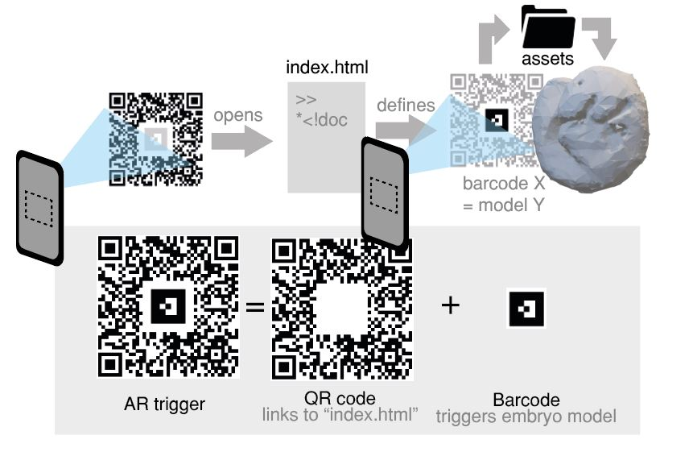

# A simple Augmented Reality setup for mouse embryo models
#### **By Stefano and Francesca Vianello**

This GitHub repository provides a simple setup with the mininal elements to make an embryo model appear when a given QR code is scanned through a phone. You could imagine incorporating custom QR codes in a figure for publication, in a poster at a scientific conference, in slides of a presentation, or wherever you would want your embryo model to appear.

* The folder :open_file_folder: "assets" contains the embryo model(s) one wants to make appear. After having created the corresponding scene in Blender, export the objects as an ".obj" file (File>Export>Wavefront (.obj)). This will also create a materials file (.mtl). Copy both files in this folder.

* The folder :open_file_folder: "barcodes" contains a library of black and white motifs that can be used as triggers of your embryonic model. When the camera of the phone will detect one of these motifs, the corresponding object from your asset folder will appear.

* The entire set up is coded in the file "index.html", based on [AR.js](https://aframe.io/blog/arjs/). In short, this defines the barcode you chose and associates to it the asset you uploaded, and to the material of the object (i.e. colour). Other parameters are also specified here (e.g. size of the object, distance from trigger, etc...)   

The compund AR trigger (i.e. the QR code that launches your index.html, and the barcode that triggers the embryonic model) was assembled by running the script "qr_generator.py"

